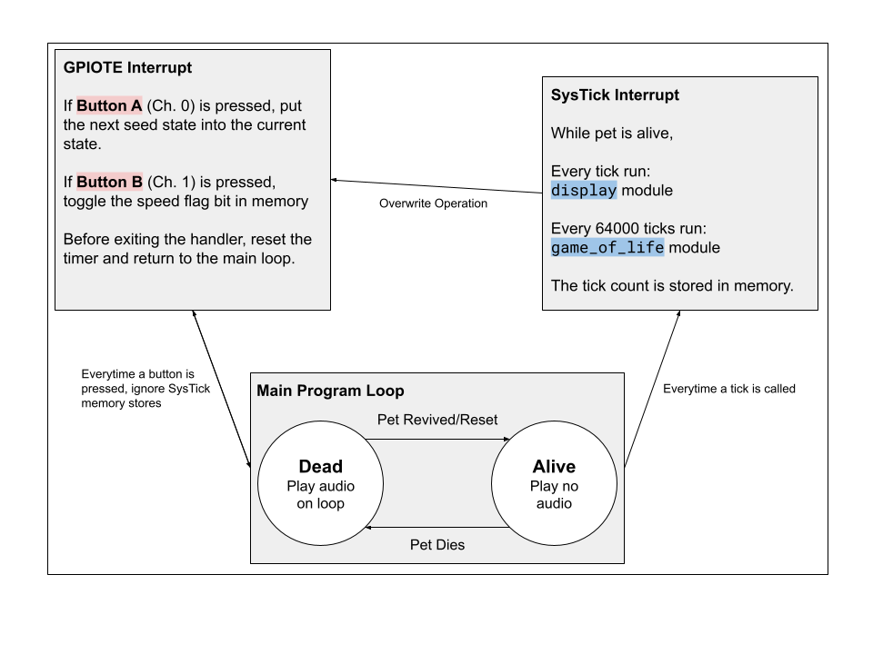
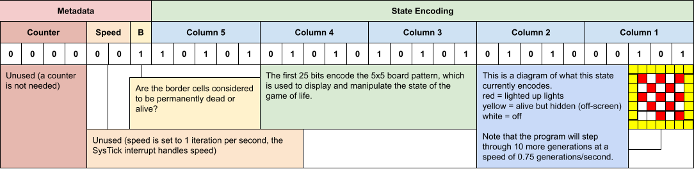

# The GOL Pet Edition - Design Document

## Design

The GOL pet is a digital pet which relies on iteratively generated states following Conway's Game of Life. These GOL states act as a display for the pet, memory is used to store information about the pet e.g. the current GOL state to be displayed.

Interrupts are used to allow interactivity. The following interrupts/inputs are used:
- Button A resets the pet to a new seed state (GPIOTE)
- Button B speeds up the pet's evolution. Will do nothing if pet is dead (GPIOTE)
- A timer to iterate through GOL states and handle display (SysTick)

The speed of iteration will only increase **after** the button has been pressed.

The speaker is used as an additional feature, emitting a sound when the pet dies. The pet dies when the board is empty i.e. all cells are dead.

**IMPORTANT:** Some states will never die. Some states may have an 'on' border, which may increase the pet's longevity by altering the GOL rules on boundary cells.

## Implementation

Code developed in assignment 1 was re-used in development. This is because it already had the iteration and display mechanics prepared. However, modifications had to be made in order to cooperate with interrupts. For example, the GOL reads from memory instead of register 12, and the button interrupts now override all operations.

The display module was altered so that it could take advantage of the SysTick interrupts, rather than a pre-set iteration count. This also means that all GOL operations can be modified on the SysTick interrupt handler.

In order to prevent 'race conditions' the button interrupts were given higher priority, furthermore once a button is pressed, a flag in memory is set to prevent the `game_of_life` and `display` modules from overwriting the memory state.

The control flow between interrupts and programs are shown in the diagram below:

The memory stores the current state of the board, in addition to other variables like an array of seed states that get read from on reset. The state string is below:

## Analysis

I chose to use the assignment 1 code as it provided a base to launch off of, it allowed for a more complex image system, while still allowing me to demonstrate my knowledge of interrupts, memory, and the microbit's peripherals. The modifications made to the assignment 1 code were implemented to prevent the use of interrupts from altering the microbit's states, it also allowed the GOL to be run from interrupt handlers instead of a program loop.

The death checking, death loop, and main loop functions act as the main program, as the program needs to switch between states of 'live pet' and 'dead pet'. This also allows for the SysTick interrupt to be manipulated on the highest level.

The features implemented were chosen as they made the most sense, they can be implemented in a way that directly takes advantage of already written code. They also allow for an engaging experience, especially the audio output at death. One issue is deciding on what GOL states to store in the program's seed state array - as all GOL states have to end in death and must take a long time to die.

The modular approach of the code allowed for an easier implementation of interrupts, having most of the program be event-driven simplifies it's operation. However, appropriate measures had to be taken to prevent memory from being overwritten or the SysTick handler from being called at inappropriate times.